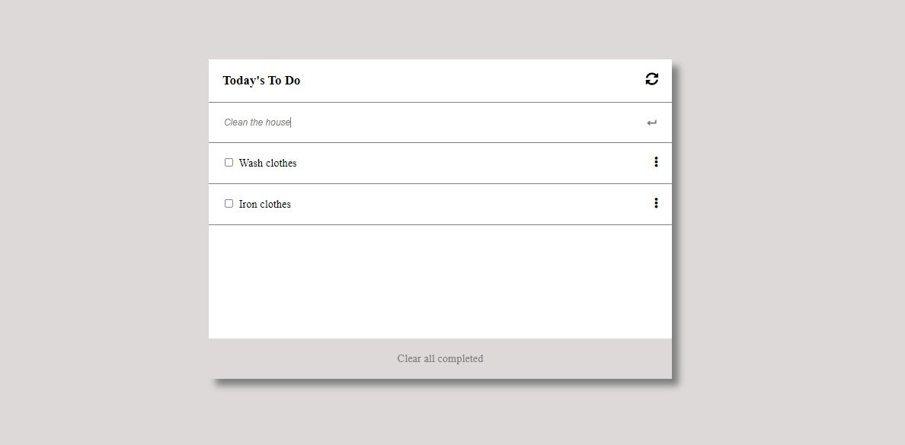

# To Do List
This project was built using a simple simple webpack

## Built With

- HTML
- CSS
- JavaScipt
- ES6
- Webpack

## Live Demo

[Live View!!](https://adanzeakonobi.github.io/To-do-list/dist/)

## Author

👤 **Adaobi Okoye**

- GitHub: (https://github.com/Adanzeakonobi/To-do-list.git)

## Getting Started

### Prerequisites:

- Web browser
- Code Editor (VS Code)
- Live Server Extension

### Cloning the repo to your local system (If you already have git, installed in your system):

- [Copy this link](https://github.com/Adanzeakonobi/To-do-list.git)
- Open your terminal or command line
- Run "git clone [Paste this link](https://github.com/Adanzeakonobi/To-do-list.git)"
- Open the folder with your code editor
- Now You can edit the code and check the changes in the browser using Live Server

### Web-pack Setup

- Install Web-pack: Run npm install webpack
- Update Distribution folder with the changes from Source folder: Run npm run build
- Check the live changes through the local host: Run npm start

### Check linter errors:

- Install npm
- For HTML: Run npx hint .
- For CSS: Run npx stylelint "**/*.{css,scss}"
- For JS: Run npx eslint .

## 🤝 Contributing

Contributions, issues, and feature requests are welcome!

Start by:

- Forking the project
- Cloning the project to your local machine
- cd into the Youtube-Replica project directory
- Run git checkout -b your-branch-name
- Make your contributions
- Push your branch up to your forked repository
- Open a Pull Request with a detailed description to the development branch of the original project for a review

Feel free to check the [issues page](https://github.com/Adanzeakonobi/To-do-list.git), contribute to the Project by creating an issue.

## Show your support

Give a ⭐️ if you like this project!

